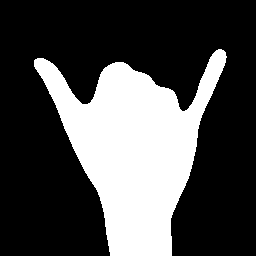
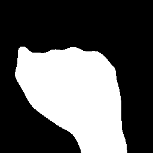
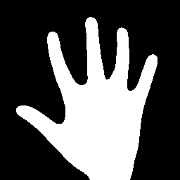
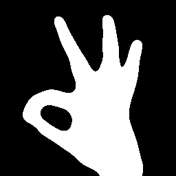
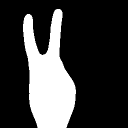
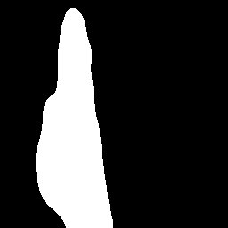

# Hand Gesture Recognition System
College Project- A dynamic hand gesture recognition system for controlling music player. This model recognizes hand gestures in real-time using Convolutional Neural Networks.

## Project Description

The app consists of 3 different modes:
1. __**Data Collection Mode:**__ Allows the user to collect train, test, or validation data on a variety of hand gestures
2. __**Model Testing Mode:**__ Test the model's ability to discern between different gestures through real-time visualizations
3. __**Music-Player/Gesture Mode:**__ Use gestures to play music, pause music, and change the volume of music

## Project Working

### Capture of Images Through a Webcam-
If the webcam is properly installed, OpenCV would easily detect it and OpenCV capture functions can be used to get the images from the camera. The `cv2.VideoCapture()` function initializes capturing video from the camera and stores it in the `cv2Capture` structure, which is the video capturing structure.

### Implement the Algorithms Using Python and OpenCV-
The next step was to implement the needed algorithms i.e. OpenCv bg subtraction algorithm to process the images and to recognize the gestures, using python and OpenCV. The resulting program should do the following procedure:
* Created a Region of Interest (ROI)
* Capture the background
* Create a background mask
* Use thresholding to create a binary
* Capture data

### Trained, Validated and Tested Model using Keras on Kaggle’s Cloud Platform-
* Convert Images to NumPy Arrays
* Designed a CNN Network Using Keras
* Trained Model on Kaggle Cloud Platform
* Evaluated on 500 validation images and 500 test images
* Test Accuracy: 99.8%

### Create a PyGame Music Application and Triggered Commands Using Gestures
The next step was to create a music application using python’s pygame library to apply the model and defined functions for each of the gesture bindings created. The gestures used are as follows:

###### Figure 1- Rad: Loads Song

###### Figure 2- Fist: Plays/Un-pause Song 

###### Figure 3- Five: Pause Song

###### Figure 4- Okay: Increase Volume

###### Figure 5- Peace: Decrease Volume

###### Figure 6- Straight: Stop Song and Rewind Song upon playing

###### Figure 7- None: Do Nothing

### Packages Used
- OpenCV 
- Keras
- Tensorflow
- PyGame
- NumPy

## Project Structure
Here's a list of files in the directory:
- `src/demo.py`: Contains all the functions to start and run the app
- `src/music`: Contains the song that will be played during gesture mode
- `src/my_model-weights.h5`: trained weights to feed the model

### How to run?
To run the application :
1. Clone repository using `git clone`
2. `cd` to project directory 
3. Set-up a virtual environment and activate it
4. Install all dependencies using the command `pip install -r requirements.txt`
5. `cd` to the src folder
6. Run the python script using `python demo.py` command

### Where to find help?
* For setting up the virtual environment refer the [official documentation](https://packaging.python.org/guides/installing-using-pip-and-virtual-environments/) 
* If not all the dependencies get installed using  `pip install -r requirements.txt`, go to the official website and documentation for installing them manually

